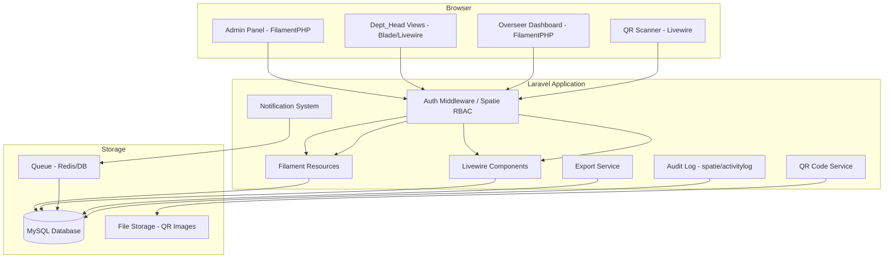
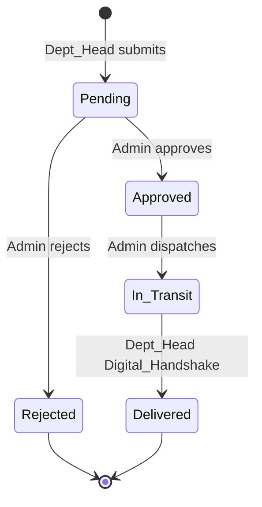
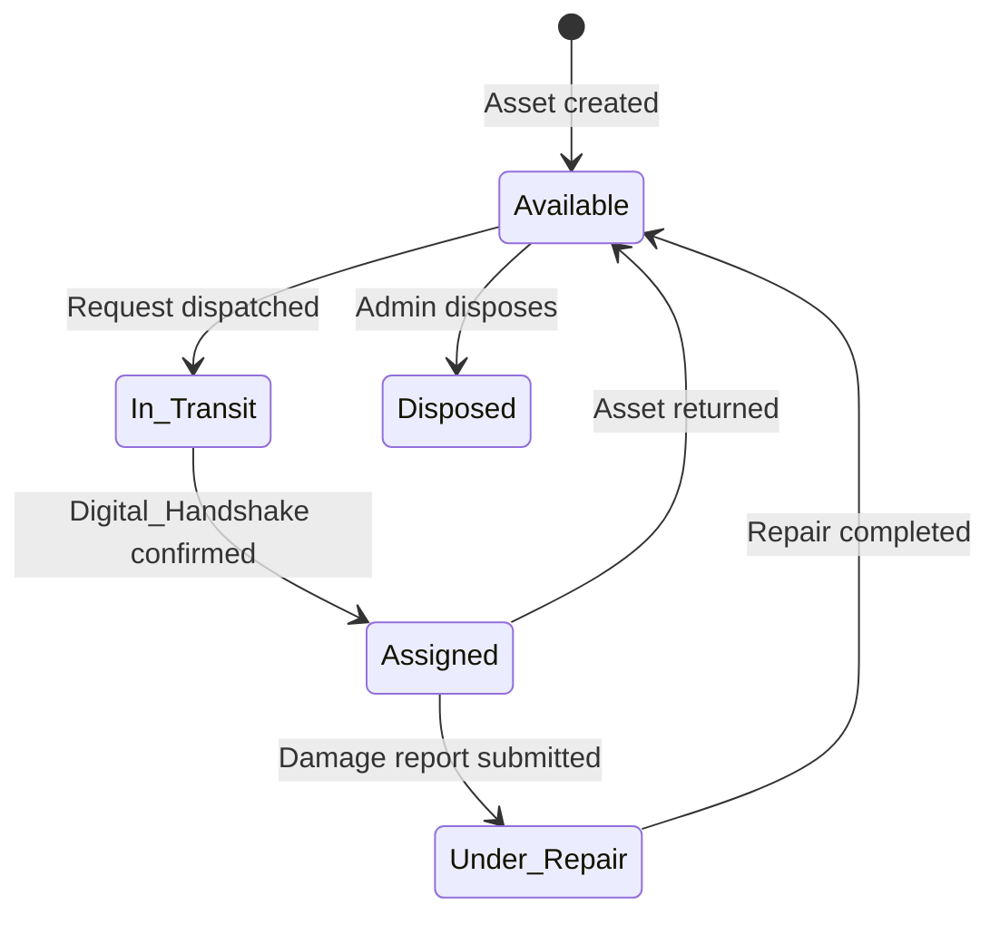
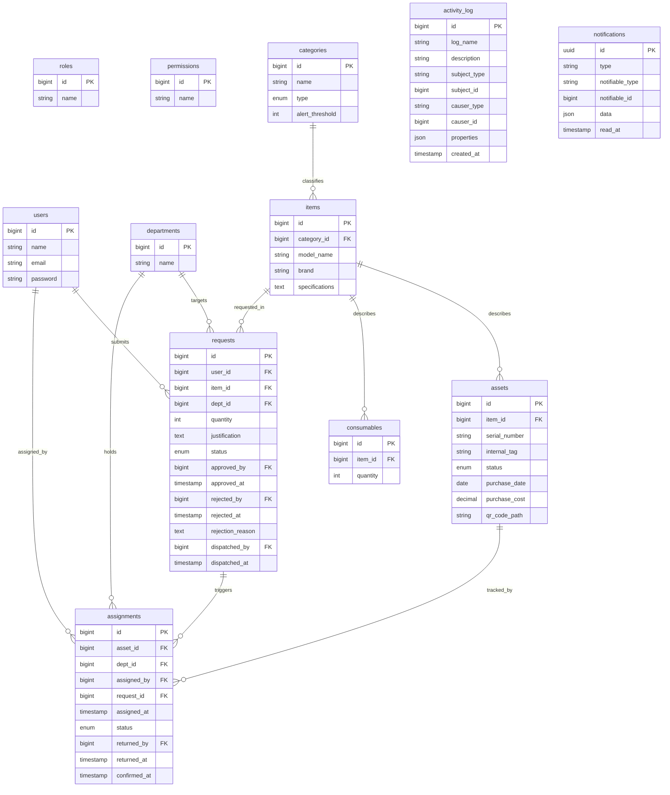

# Design Document: PublicAsset OS

## Overview

PublicAsset OS is a high-accountability asset and consumable management system for public offices built on **Laravel 11** with **FilamentPHP** for admin panels, **Livewire** for reactive UI components, and **Spatie Laravel-Permission** for RBAC. The system enforces a "Digital Handshake" model ensuring no asset transfer is considered complete until the recipient explicitly confirms receipt, creating a tamper-resistant audit trail.

The application serves three distinct roles — Admin, Dept_Head, and Overseer — each with a scoped interface. The core domain revolves around the lifecycle of physical Assets and bulk Consumables, from procurement through assignment, return, and disposal.

### Key Design Decisions

- **FilamentPHP** is used for all admin-facing CRUD interfaces, providing a consistent, low-boilerplate panel with built-in table filtering, form validation, and resource management.
- **Spatie Laravel-Permission** replaces the custom role/permission system already partially scaffolded, providing a battle-tested RBAC layer with middleware integration.
- **Laravel Notifications** (database + mail channels) handles all event-driven alerts, leveraging Laravel's built-in queue system for retry logic.
- **simplesoftwareio/simple-qrcode** generates QR codes server-side, stored in `storage/app/public/qrcodes/`.
- **maatwebsite/excel** handles Excel/PDF export for Overseer reports.
- **spatie/laravel-activitylog** provides immutable audit logging for all critical model changes.

---

## Architecture

The system follows a standard Laravel MVC architecture with FilamentPHP layered on top for the admin panel. Livewire handles reactive components (QR scanner, notification badge, request status updates) without a full SPA framework.

### Request Lifecycle State Machine

### Asset Status State Machine

---

## Components and Interfaces

### FilamentPHP Admin Panel (`/admin`)

Accessible to `Admin` role only. Provides Filament Resources for:

- **CategoryResource** — CRUD for categories (name, type, alert_threshold)
- **ItemResource** — CRUD for items (model_name, brand, specifications, category_id)
- **AssetResource** — CRUD for assets with QR code generation action
- **ConsumableResource** — CRUD for consumables with quantity management
- **RequestResource** — List/approve/reject/dispatch requests
- **AssignmentResource** — View assignment history, record returns
- **DepartmentResource** — CRUD for departments
- **UserResource** — CRUD for users with role assignment
- **AuditLogResource** — Read-only searchable audit log view

### Overseer Panel (`/overseer`)

Separate FilamentPHP panel accessible to `Overseer` role. Contains:

- **ExpenditureWidget** — Total procurement cost grouped by Category/Department
- **DepreciationWidget** — Asset list with straight-line depreciation values
- **ConsumableUsageWidget** — Monthly consumption trends per item
- **WasteAuditWidget** — Requests approved but asset unused >30 days
- Export actions for Assignment history, Request history, expenditure reports

### Livewire Components

- **NotificationBell** — Unread count badge in nav, marks notifications read on click
- **QrScanner** — Mobile-responsive camera-based QR scanner using a JS library (e.g., `html5-qrcode`), submits decoded value to server for asset lookup
- **RequestForm** — Dept_Head requisition submission form
- **DigitalHandshake** — Confirmation form for Dept_Head to accept asset receipt
- **DamageReportForm** — Dept_Head damage reporting form

### Services

- **QrCodeService** — Generates QR code PNG from asset metadata, stores to disk, returns path
- **ExportService** — Wraps maatwebsite/excel to generate Excel/PDF exports
- **DepreciationService** — Calculates straight-line depreciation given purchase cost, purchase date, and configurable useful life

### Middleware

- `role:Admin` — Spatie middleware restricting routes to Admin role
- `role:Dept_Head` — Restricts to Dept_Head role
- `role:Overseer` — Restricts to Overseer role
- `auth` — Standard Laravel authentication guard

---

## Data Models

The existing migrations provide the base schema. The design extends and corrects them to match requirements.

### Schema Corrections / Additions Required

The existing `assets` migration uses statuses `available, assigned, damaged, retired` — requirements specify `Available, Assigned, In_Transit, Under_Repair, Disposed`. The existing `requests` migration uses `pending, approved, denied, delivered` — requirements specify `Pending, Approved, Rejected, In_Transit, Delivered`. Migrations need updating.

The existing `assignments` table is missing `request_id` and `returned_by` columns. The `requests` table is missing `dept_id`, `justification`, `approved_by`, `approved_at`, `rejected_by`, `rejected_at`, `rejection_reason`, `dispatched_by`, `dispatched_at`.

### Entity Relationship Diagram

### Model Descriptions

**Category** — `HasMany Items`. Deletion blocked if items exist.

**Item** — `BelongsTo Category`, `HasMany Assets`, `HasOne Consumable`, `HasMany Requests`. Deletion blocked if assets, consumables, or requests exist.

**Asset** — `BelongsTo Item`, `HasMany Assignments`. Status transitions logged via activity log. QR code path stored after generation.

**Consumable** — `BelongsTo Item`. Quantity must be non-negative. Low-stock notification triggered when quantity ≤ category alert_threshold.

**Request** — `BelongsTo User (requester)`, `BelongsTo Item`, `BelongsTo Department`, `BelongsTo User (approver)`, `BelongsTo User (rejecter)`, `HasMany Assignments`. Full status lifecycle with actor/timestamp columns per transition.

**Assignment** — `BelongsTo Asset`, `BelongsTo Department`, `BelongsTo User (assigned_by)`, `BelongsTo Request`, `BelongsTo User (returned_by)`. Status: `Pending_Acceptance` → `Accepted`. Prevents simultaneous assignment of same asset to multiple departments via unique constraint on `asset_id` where `returned_at IS NULL`.

**Department** — `HasMany Assignments`, `HasMany Requests`, `HasMany Users`.

**User** — Uses Spatie `HasRoles` trait. `BelongsTo Department` (nullable for Admin/Overseer).

---

## Error Handling

### Validation Errors
- All Filament form submissions use Laravel's built-in validation. Errors surface inline in the form via Filament's error display.
- API-style errors (e.g., Digital_Handshake denial, assignment rejection) return JSON `{message: "...", errors: {...}}` with appropriate HTTP status codes (422 for validation, 403 for authorization).

### Authorization Errors
- Unauthorized route access returns HTTP 403 and redirects to a role-appropriate error page via a custom `Handler` entry.
- Dept_Head attempting Digital_Handshake on another department's asset returns 403 with a descriptive message.

### Business Rule Violations
- Consumable approval when stock is insufficient: returns a Filament notification (toast) with a descriptive error, does not transition request status.
- Assigning an asset not in `Available` status: returns a validation error before the assignment record is created.
- Deleting a Category/Item with dependents: uses a `before_delete` observer or Filament action hook to check and return a descriptive error.

### Notification Delivery Failures
- Email notifications are queued. Failed jobs are caught by Laravel's queue failure handler, logged to `failed_jobs` table with recipient, event type, and timestamp.
- Retry policy: 3 attempts with exponential backoff (1s, 2s, 4s delays) configured on the notification job.

### QR Code Errors
- Unrecognized QR code scan: returns a user-facing error message "QR code not recognized. No asset found matching this code."
- QR generation failure (disk full, etc.): logged to Laravel's error log, admin shown a Filament error notification.

### Export Errors
- Export timeout (>30s for ≤10,000 records): queued export jobs with a download link sent via notification when complete.
- Export failures logged with the requesting user, export type, and timestamp.

---
